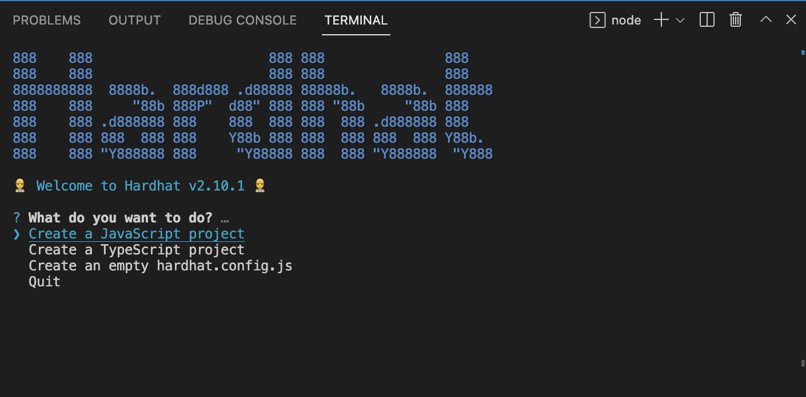
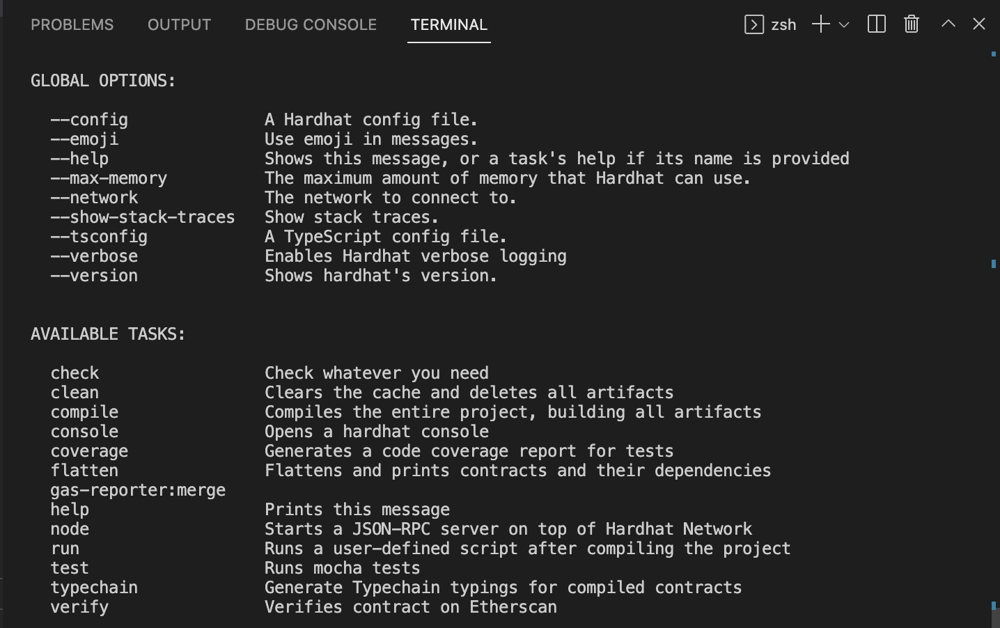

# HARDHAT BASICS

In this project, I setup a hardhat environment and play around with key features provided off-the-shelf by hardhat

I discuss

    - Setting up
    - Compiling contracts
    - Testing contracts
    - Deploying contracts
    - Writing scripts and tasks
    - HRE
    - Compilation artificats
    - Plugins
    - Other hardhat components

---

## HARDHAT INSTALLATION & SETUP

### Introduction

- Hardhat is a development environment for Ethereum
- It supports editing, compiling, deploying and testing smart contracts and dApps
- We interact with Hardhat Runner - main component that helps in running tasks
- Hardhat is designed around concept of tasks and plugins
- Everytime we write a command on console, we are running a task, eg.

                yarn hardhat compile

  runs a built-in `compile` task

### Installation

Create a empty project, open a terminal in that project and type

                yarn add --dev hardhat

To create a new Hardhat project, we do

                yarn hardhat

You should see the following options

Let us pick typescript as it is recommended by Hardhat team

We can check all options and available tasks by doing

                yarn hardhat

You should see a list of global options and tasks

Install following packages to get all functionality of Hardhat
            yarn add --dev @nomiclabs/hardhat-ethers@npm:hardhat-deploy-ethers ethers

---

### Configuration

When hardhat is run, it searches for the closest hardhat.config.ts. It is usually in root folder and contains all the configuration for hardhat to work

To setup a config file, we need to export an object from hardhat.config.js

This object can have entries for

- network (specify network name, url, accounts, chainId etc)
- solidity (solidity versions to compile)
- paths - ??
- defaultNetwork - network that gets connected by default
- mocha - specify parameters for testing

`networks` field maps network to its configuration. 2 kinds of networks - JSON-RPC based network and built-in hardhat network

We can set `defaultNetwork` - which gets connected if we don't explicitly specify network

**Hardhat network**

Hardhat comes built in with a special network called `hardhat` - when using this network, instance of hardhat network is automatically created to run a task/script or test smart contracts

**JSON-RPC based network**

Networks that connect to an external node - this node can be running on local machine (eg. ganache) or infrastructure provider such as infura/alchemy

To configure a JSON-RPC based network, some important fields in the config object

- _url_: JSON RPC url of node provider. Not needed for local
- _chainId_: chain id of connected chain
- _accounts_: field controls which account Hardhat uses. It can use node accounts by setting to `remote`, list of local accounts (by providing an array of private keys). Default value is `remote`
- _from_: address to use as default sender. If not specified, automatically pics first account
- _gas_: value should be `auto` or 0. If value specified, it will be gas limit for every transaction by default. If `auto`, gas limited is automatically estimated (this is default)
- _gasPrice_ - should be `auto'. If specified, it will be max gas price for txns
- _gasMultiplier_ - a number used to add some slack to gas. default value is 1.
- _timeout_ - timeout in ms for requests sent to network. for local, default is 40000, for other networks 20000

**solidity**

Solidity object specifies the configuration of compiler. We can provide multiple configurations as well

Multiple compiler versions can be specifed as follows

            solidity: {
                compilers: [
                    {
                        version: "0.8.7",
                    },
                    {
                        version: "0.6.6",
                    },
                    {
                        version: "0.4.24",
                    },
                ],
            },

**mocha**

Mocha is the testing framework used by hardhat. Most important setting here is `timeout` - specially needed when we run tests on external networks

            mocha: {
                timeout: 200000, // 200 seconds max for running tests
            },

---

### Setting up a project

Once a hardhat project is initiated, we notice that there are following folders created

- `contracts` - all solidity contracts go here
- `scripts` - all scripting logic goes here
- `test` - all unit and integration tests go here

### Libraries

Harhdat comes with some useful functionality provided by embedded librariers

- `Ethers.js` - For connecting with contracts, managing wallets etc
- `Chai` - chai is an assertion library and `Mocha` is the test runner
- `Hardhat Network` - helps run a local chain for local testing
- `Hardhat Network Helper` - provides a javascript interface to JSON-RPC functionality of hardhat network

### Plugins and dependencies

Plugins are the backbone of hardhat - most hardhat functionality is extended via plugins

Add a plugin by importing it into `harhdat.config.ts` as below

                import "@nomicfoundation/hardhat-toolbox";

---

## COMPILING CONTRACTS

To compile contracts use

                $ yarn hardhat compile

Compiled contracts will be shared in `artifacts` folder

After initial compilation, if no changes are made, Hardhat does not compile contract again. If only one file is modified, only that file is recompiled.

To force compilation we can do

                $ yarn hardhat compile --force

To clean all existing contract files in `artifacts` we can do

                $ yarn hardhat clean

***

## TESTING CONTRACTS

**Writing Tests**
After compiling contracts, next step is to test logic

- We use `mocha` and `chain` libraries to run test
- Hardhat team recommends `Typescript` because we can catch type errors and have better auto completion support
- Below is a generic structure of a unit test
    - describe() and it() are global mocha functions
    - describe() -> takes contract name & executes a callback
    - beforeEach() -> executes logic before each descrive
    - it() -> each unit test is inside the callback of it()
    - to check if something matches a value, we use expect()
    - to assert if something should throw an error, use expect().to.be.revertedWith()

                import { assert, expect } from "chai"
                import { ethers, Contract} from "ethers"

                describe("Contract name", () => {
                    beforeEach(async () => {
                        console.log("executes before each test")
                        const contract = await ethers.getContractFactory("Contract")
                        ....
                    })

                    describe("test component", () => {
                        console.log("testing a specific function/event inside contract")
                        it("unit test description", async () => {

                            console.log("Write unit test here")

                            expect(<actual output>).to.equal(<expected output>)

                            expect(<actual output>).to.be.revertedWith(<error message>)
                        })
                    })
                })

**Checking Coverage**

Hardhat toolbox includes `solidity-coverage` plugin to measure test coverage in your project.

                yarn hardhat coverage

**Gas Reporter**

Hardhat toolbox contains `hardhat-gas-reporter` plugin to get metrics of gas used, based on test execution. `REPORT_GAS` environment variable should be set to true in `hardhat-config.ts`

***

## DEPLOYING CONTRACTS

***